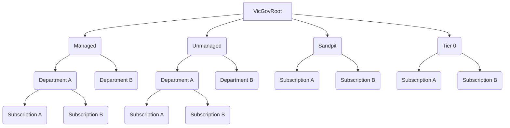

# VICGOV - Azure Policy as Code Workflow
## 1. Introduction
### 1.1	Overview

As a result of outstanding Azure charges, Hosting Platform Services has been working with numerous Customer Account, Managers, Finance and Business technology teams to resolve a number of issues which have presented and have resulted in outstanding invoices under dispute with customers.

This document is intended to provide a high level overview of workflow how the new subscription onboarding process works including
- policy for tags.
- updating customer billing reference table.
- configuring azure monitoring.

Included in this report is a step by step detailed guide around where to look for troubleshooting.

## 2 Logical Architecture
### 2.1	Logical System Component Overview

1. A new subscription gets created.
2. The subscription needs to be moved to "Build" management group.
3. The engineer will trigger the Azure Devops pipeline.
4. The CICD pipeline will send POST HTTP webhook trigger to APIM to push policies.
5. Azurepolicyfuncapp will update the customer reference table and notify CTX finance team via email.
6. The CICD pipeline will will provision eventgrid and intergrate with monitoring solution.

## 3 Management Group Structure
### 3.1	Management Group Structure Overview

## 4 Tagging
The following section lists tags required at a subscription level.  Alternatively, a custom policy can be used to automatically tags all resource groups with these tags. 

|Tag|Description|Example|Required/Optional
|---|-----------|-------|-----------------
Customer|Customer Name|Customer ABC|Required
CostCenter|Unique Cost Center provided by the customer|00123|Required
Environment|Environment Name|Dev|Required
Application| Business Application Name|HR|Required
ApplicationSubResources|Resources that make up the application|WebApp;DB;MiddleTier|Required
SupportLevel|Support level for the subscription - set to "None" if unmanaged|Bronze/Silver/Gold|Required
Storage|Storage type used in the subscription|GRS/LRS/ZRS|Required
VirtualMachines|List of VM Names provisioned under the subscription|"VM0011;VM0012"|Required
ResourceShutdown|Start and End Time for the automated shutdown |9-17 or 8-19|Optional
CustomerEmailDistributionList|Ditribution group email of the customer |xxxx@customerabc.vic.gov.au"|Required
